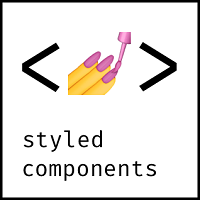
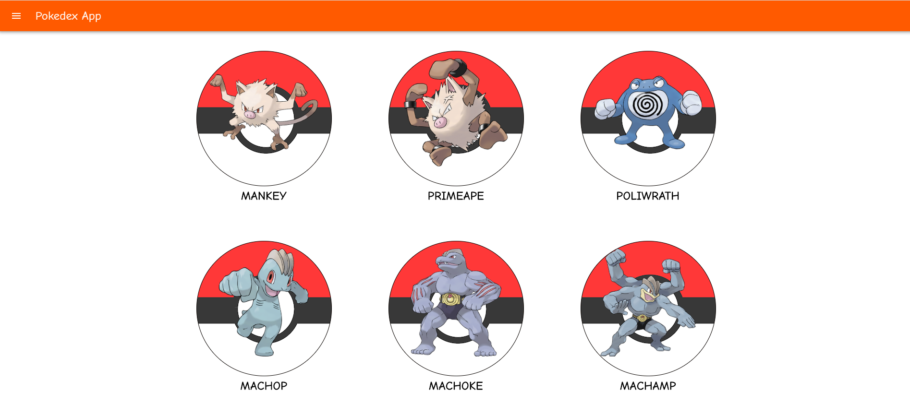
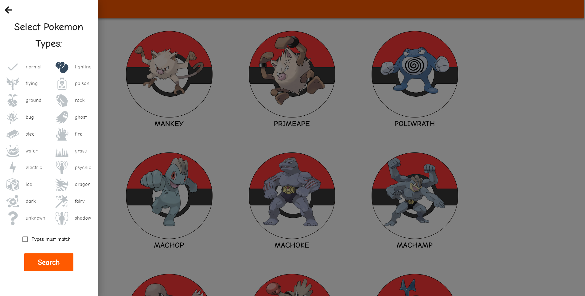
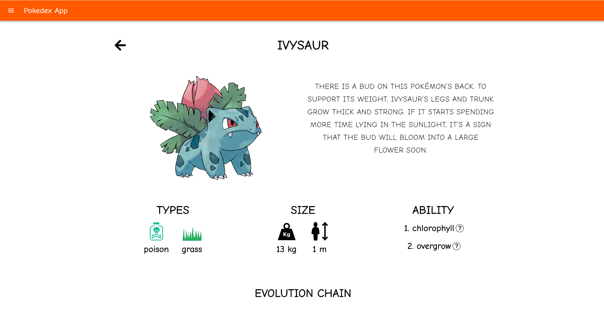

# Pokedex App
Pokemon library. Catch them all!

# Notice
- Library has a base of 807 pokemon
- The application uses pokemon pictures from https://pokeres.bastionbot.org

# Demo : 
App was deployed on Firebase server:

https://pokedex-app-2e1c0.web.app/

# Technologies :
     
 

- React + Redux + Hooks
- React Material UI
- Styled Components
- Sass
- Axios
- and other...

# Preview

# Tasks :
-`npm install` or `yarn install` to install package
-`npm start` or `yarn start` to start project 

<b> ENJOY !</b>

